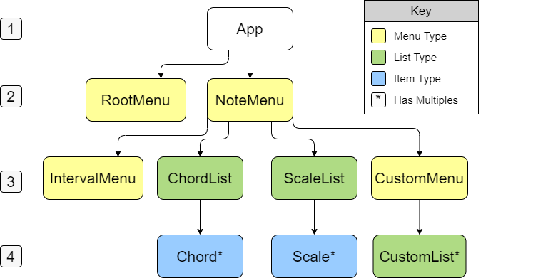

This project was bootstrapped with [Create React App](https://github.com/facebook/create-react-app).

# Interactive Chord & Scale Dictionary

## Author: Tyler Yates

This project provides a centralized place for musicians and music students to access resources such as scales, chord types/guitar chord diagrams, intervals, and more.

### Minimum Features:

* Scale and Chord Lists that direct to more specific lists/diagrams
* Place to Enter a Note/Notes
* Interval Display

### Technologies Used

* Javascript  
* React  
* Redux  
* UberChord API

### Stretch Goals

* Users can saves sets of chord diagrams/scales under custom names
* User can click on notes in a scale to play that note’s tone
* Add chord diagrams for other instruments
* Add more complex/non-western/microtonal scales

### Additional Technologies

* React-sound
* Possibly other sound library
* Additional Chord API
